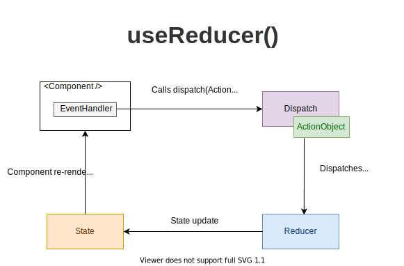

# Read Class 29: Advanced State with Reducers

The reducer is a pure function that accepts 2 parameters: the current state and an action object. Depending on the action object, the reducer function must update the state in an immutable manner, and return the new state.

An alternative to useState. Accepts a reducer of type (state, action) => newState, and returns the current state paired with a dispatch method. (If you’re familiar with Redux, you already know how this works.)

useReducer is usually preferable to useState when you have complex state logic that involves multiple sub-values or when the next state depends on the previous one. useReducer also lets you optimize performance for components that trigger deep updates because you can pass dispatch down instead of callbacks.

There are two different ways to initialize useReducer state. You may choose either one depending on the use case. The simplest way is to pass the initial state as a second argument.

### Lazy initialization

You can also create the initial state lazily. To do this, you can pass an init function as the third argument. The initial state will be set to init(initialArg).

It lets you extract the logic for calculating the initial state outside the reducer.

The useReducer Hook is used to store and update states, just like the useState Hook. It accepts a reducer function as its first parameter and the initial state as the second.

useReducer returns an array that holds the current state value and a dispatch function to which you can pass an action and later invoke it. While this is similar to the pattern Redux uses, there are a few differences.

For example, the useReducer function is tightly coupled to a specific reducer. We dispatch action objects to that reducer only, whereas in Redux, the dispatch function sends the action object to the store. At the time of dispatch, the components don’t need to know which reducer will process the action.

For those who may be unfamiliar with Redux, we’ll explore this concept a bit further. There are three main building blocks in Redux:

- A store: An immutable object that holds the application’s state data
- A reducer: A function that returns some state data, triggered by an action type
- An action: An object that tells the reducer how to change the state. It must contain a type property and can contain an optional payload property

Let’s see how these building blocks compare to managing state with the useReducer Hook. Below is an example of a store in Redux:

> import { createStore } from 'redux'
>
> const store = createStore(reducer, [preloadedState], [enhancer])

In the code below, we initialize state with the useReducer Hook:

> const initialState = { count: 0 }
>
> const [state, dispatch] = useReducer(reducer, initialState)

The reducer function in Redux will accept the previous app state and the action being dispatched, calculate the next state, and return the new object. Reducers in Redux follow the syntax below:

> (state = initialState, action) => newState

### The dispatch method

The dispatch function accepts an object that represents the type of action we want to execute when it is called. Basically, it sends the type of action to the reducer function to perform its job, which, of course, is updating the state.

The action to be executed is specified in our reducer function, which in turn, is passed to the useReducer. The reducer function will then return the updated state.

The actions that will be dispatched by our components should always be represented as one object with the type and payload key, where type stands as the identifier of the dispatched action and payload is the piece of information that this action will add to the state.
